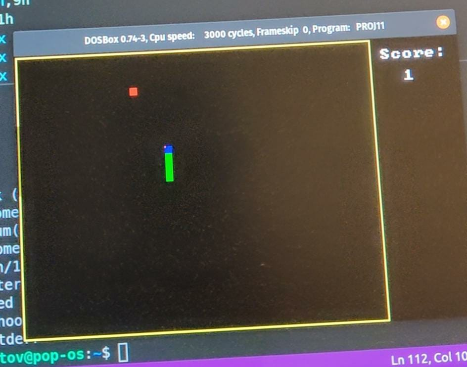

# 8086-snake-graphic
# Snake game with asm 8086 DosBox

<!-- ABOUT THE PROJECT -->
## About The Project

Project of 10th grade that i had to do, making a game with assembly.
I made TicTacToe game but also tried to do Snake and in the end i chose Snake 
to be the project that will be graded

### Built With

Assembly 8086 16bit

<!-- GETTING STARTED -->
## Getting Started
tasm /zi name
tlink /v name

### Example

### Prerequisites

DosBox and tasm/tlink

## License

Distributed under the MIT License. See `LICENSE` for more information.

